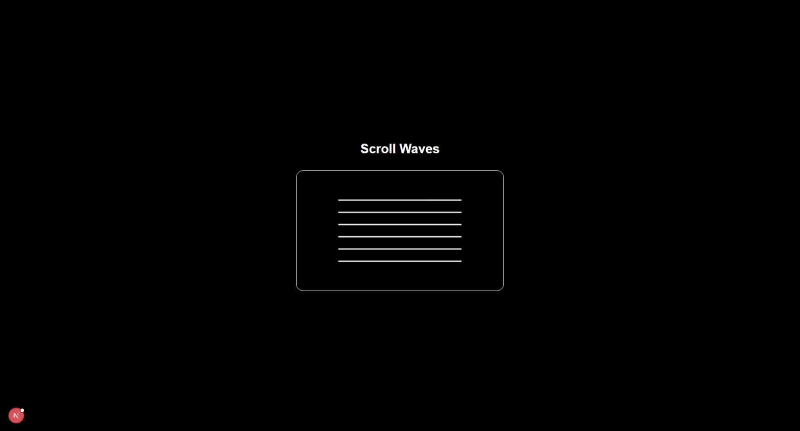
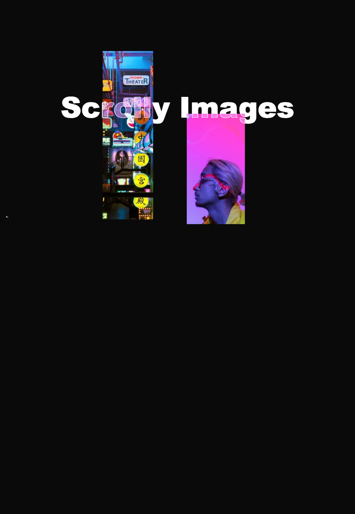
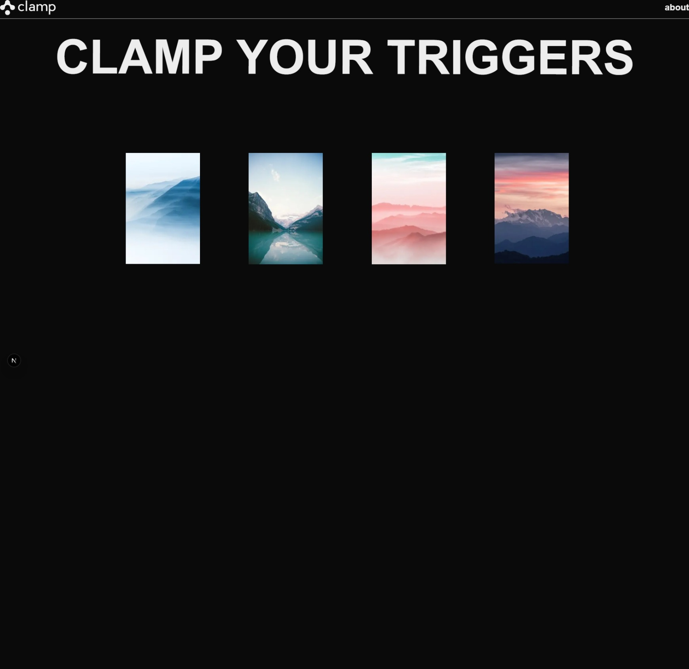
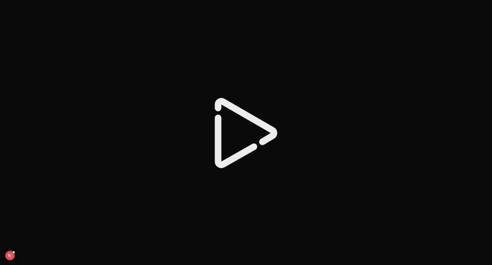
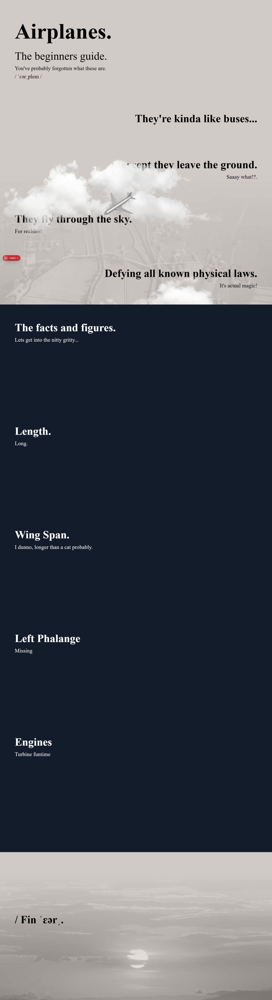
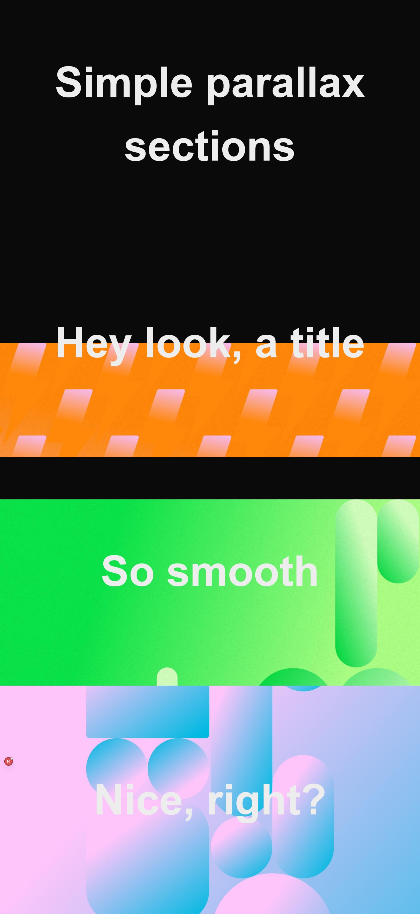
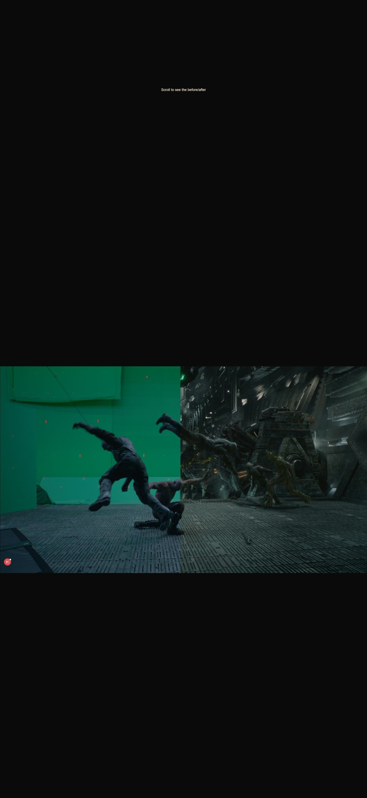
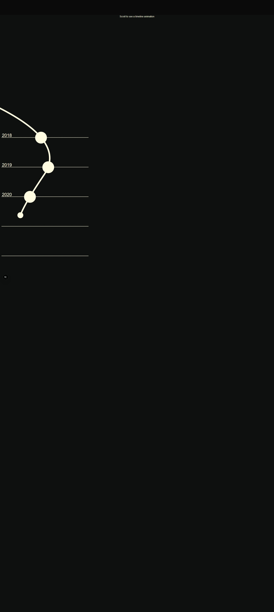
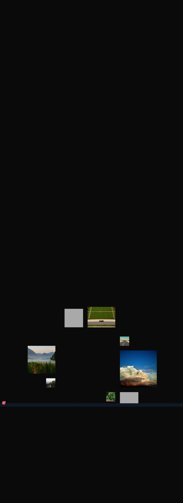
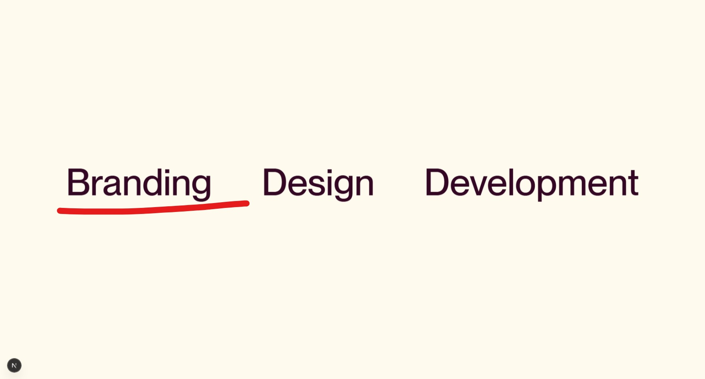

# Your Project Title (GSAP Code Book)

This is a [Next.js](https://nextjs.org) project bootstrapped with [`create-next-app`](https://www.google.com/search?q=%5Bhttps://nextjs.org/docs/app/api-reference/cli/create-next-app%5D\(https://nextjs.org/docs/app/api-reference/cli/create-next-app\)). It serves as a code book for GSAP animations.

-----

## Getting Started

To get your development environment up and running, follow these steps:

### 1\. Clone the Repository

First, you need to get a copy of the project files. Open your terminal or command prompt and run the following command:

```bash
git clone https://github.com/Debabrata-Giri-2001/GSAP_CODE_BOOK.git
```

### 2\. Navigate to the Project Directory

Once the repository is cloned, change into the project's directory:

```bash
cd GSAP_CODE_BOOK
```

### 3\. Install Dependencies

Next, install all the necessary project dependencies. You can use `npm`, `yarn`, `pnpm`, or `bun` depending on your preference:

```bash
npm install
# or
yarn install
# or
pnpm install
# or
bun install
```

### 4\. Run the Development Server

Finally, start the development server:

```bash
npm run dev
# or
yarn dev
# or
pnpm dev
# or
bun dev
```

This will typically start the application on [http://localhost:3000](https://www.google.com/search?q=http://localhost:3000). Open this URL in your browser to see the result.

-----


<details open>
<summary>Project 3</summary>

Content is available in [this file](./app/project3/GSAPObserver.tsx)

-----

# 3D Carousel with GSAP Observer

This project features an interactive 3D carousel component built with **React** and animated using **GSAP (GreenSock Animation Platform)**. It leverages GSAP's **Observer plugin** to allow users to navigate the carousel smoothly via mouse wheel scrolling or pointer dragging.

-----

## Features

  * **Immersive 3D Carousel:** Images are dynamically arranged in a circular, three-dimensional layout, providing a visually engaging experience.
  * **Intuitive Navigation:**
      * **Mouse Wheel Control:** Scroll up or down to effortlessly rotate the carousel.
      * **Drag-and-Drop Interaction:** Click and drag the carousel with your pointer for direct rotational control.
  * **Fluid Animations:** Powered by GSAP, all movements and transitions are exceptionally smooth and high-performance.
  * **Responsive Layout:** The carousel's design is flexible, adapting well to various screen sizes.

-----

## Technologies Used

  * **React:** For building the user interface.
  * **GSAP (GreenSock Animation Platform):** The core animation engine, specifically utilizing:
      * **`useGSAP` hook:** To integrate GSAP animations seamlessly within React.
      * **`Observer` plugin:** To handle user input from wheel and pointer events.
  * **Tailwind CSS (Assumed):** Likely used for efficient and utility-first styling, given the class names in the provided structure.

-----


## Core Logic Overview

The carousel's animation is managed within a `useGSAP` hook in the main component. It listens for `wheel` and `pointer` events on the carousel container using GSAP's **Observer**. When an interaction occurs, it calculates the desired rotation based on the input (deltaY for wheel, deltaX for pointer) and then uses `gsap.to()` to smoothly animate a `progress` value.

A **`gsap.ticker.add(animate)`** function continuously updates the position and rotation of each `.carousel-image` element. It calculates each image's 3D transform (`translate3d` and `rotateY`) based on its index and the current `progress.value`, effectively creating the circular 3D effect. The `radius` variable controls the overall size of the carousel.

-----



</details>

<details open>
<summary>Project 4</summary>

Content is available in [this file](./app/project4/SmoothScrolly.tsx)

---

# Smooth Scrolly Images with GSAP ScrollSmoother

This React component, `SmoothScrolly`, creates a captivating visual experience where images exhibit a subtle skew animation based on scroll velocity. It leverages **GSAP's ScrollSmoother** and **ScrollTrigger** plugins to achieve fluid, customized scrolling and interactive effects.

---

## Features

* **Smooth Scrolling:** Implements a highly customizable smooth scrolling experience using GSAP ScrollSmoother, enhancing user navigation.
* **Velocity-Based Skew Animation:** Images dynamically skew (`skewY`) in response to the scroll velocity, adding a subtle yet engaging visual pop. The skew effect is clamped to prevent excessive distortion and smoothly resets when scrolling stops.
* **Parallax-like Effects:** Individual images can have their scroll speed adjusted using `data-speed` attributes, creating a gentle parallax effect as they move at different rates during scrolling.
* **Modern Layout:** Utilizes CSS Grid for flexible and responsive positioning of the images, allowing for complex and visually appealing layouts.
* **Text Overlays:** Includes layered text elements (`h1`) that provide a stylized visual foreground, enhancing the overall aesthetic.

---

## Technologies Used

* **React:** For building the component-based UI.
* **Next.js (`"use client"` and `next/image`):** Indicates this is a client-side component within a Next.js application, benefiting from Next.js's optimized image handling.
* **GSAP (GreenSock Animation Platform):** The powerful animation library central to the smooth scrolling and skew effects.
    * **`useGSAP` hook:** Integrates GSAP animations seamlessly with React's lifecycle.
    * **`ScrollSmoother`:** Provides the custom smooth scrolling behavior.
    * **`ScrollTrigger`:** Enables scroll-based animations and velocity tracking.
* **CSS Grid:** For the responsive and organized layout of the images.

---

## Component Structure and Styling

The component uses a fixed `wrapper` to contain the scrollable `content`. Within the `content` section, an `imagesSlide` grid holds multiple `Image` components from Next.js. Each image is absolutely positioned within its grid area using inline styles and includes a `data-speed` attribute that `ScrollSmoother` can utilize for parallax effects.

Custom CSS (from `./style.css`) is applied to the text elements for a layered, outline, and filtered appearance, creating a strong visual identity.

---

## Core Animation Logic

The animation logic resides within the `useGSAP` hook:

1.  **`skewSetter`**: A `gsap.quickTo` instance is used to efficiently apply `skewY` transformations to elements with the class `.imgSc`.
2.  **`clamp`**: A GSAP utility function to restrict the skew value between -20 and 20 degrees, preventing over-the-top distortion.
3.  **`ScrollSmoother.create`**:
    * Initializes smooth scrolling on the `wrapper` and `content` references.
    * `smooth: 2` and `speed: 3` control the smoothness and speed of the scrolling.
    * `effects: true` enables data attributes like `data-speed` for elements within `content`.
    * **`onUpdate`**: This callback fires on every scroll frame. It retrieves the current scroll `velocity` from `self` (the ScrollSmoother instance) and applies a clamped `skewY` to the `.imgSc` elements, making them skew based on how fast the user is scrolling.
    * **`onStop`**: When scrolling comes to a halt, this callback resets the `skewY` of the images back to `0`.

---


</details>

<details open>
<summary>Project 5</summary>

Content is available in [this file](./app/project5/SmoothScrolly.tsx)

-----

# ScrollTrigger Clamp with SVG Draw Animation

This React component, `ScrollTriggerClamp`, showcases an advanced scrolling experience using **GSAP's ScrollSmoother**, **ScrollTrigger**, and **DrawSVGPlugin**. It features a smooth scrolling effect across the page, a "pinned" heading section, and a dynamic SVG drawing animation that progresses as the user scrolls.

-----

## Features

  * **Smooth Scrolling Experience:** Implements a custom, smooth scrolling behavior across the entire page, enhancing user fluidity and engagement.
  * **Sticky/Pinned Heading:** A prominent heading (`.heading`) is "pinned" to the viewport as the user scrolls, keeping it in view for a period.
  * **Dynamic SVG Draw Animation:** An SVG path within the heading dynamically "draws" itself from 0% to 100% as the user scrolls past the pinned section.
  * **`clamp()` Functionality in ScrollTrigger:** Utilizes the `clamp()` feature in `ScrollTrigger`'s `start` property to ensure the trigger starts when the element is within a specified range (e.g., when the top of the trigger element is between the top and center of the viewport).
  * **Parallax Image Effects:** Images within the hero section are given `data-speed` attributes, which `ScrollSmoother` uses to create subtle parallax scrolling effects.

-----

## Technologies Used

  * **React:** For building the component-based user interface.
  * **Next.js (`"use client"` and `next/image`):** Indicates this is a client-side component within a Next.js application, leveraging Next.js's image optimization.
  * **GSAP (GreenSock Animation Platform):** The core animation library, specifically:
      * **`useGSAP` hook:** Integrates GSAP animations into the React component lifecycle.
      * **`ScrollSmoother`:** Provides the custom smooth scrolling wrapper.
      * **`ScrollTrigger`:** Manages scroll-based animations, including pinning and scrubbing.
      * **`DrawSVGPlugin`:** Animates the `stroke-dashoffset` of SVG paths to create a "drawing" effect.
  * **SVG (Scalable Vector Graphics):** Used for the logo and the dynamic drawing animation.

-----

## Component Structure and Styling

The component wraps its content within `#smooth-wrapper` and `#smooth-content` to enable GSAP's ScrollSmoother.

  * **Header:** Contains a stylized SVG logo and a navigation link.
  * **Hero Section:** Features a large, animated heading and a grid of images.
      * **`.heading` & `.pin`:** The main heading contains a `pin` div, which `ScrollTrigger` uses to keep the heading in place during scrolling.
      * **SVG Path:** An SVG element is nested within the main heading, with a `path` element (`.draw`) targeted for the drawing animation.
      * **Images:** Multiple `next/image` components are laid out in a grid, each with a `data-speed` attribute for parallax.
  * **Spacer:** A simple `div` to provide additional scrollable height.

Styling from `./style.css` (not provided in the snippet) and inline Tailwind CSS classes define the visual presentation.

-----

## Core Animation Logic

The animation setup is contained within the `useGSAP` hook:

1.  **ScrollSmoother Initialization:**

    ```javascript
    ScrollSmoother.create({
        smooth: 2, // Controls the scroll smoothness
        effects: true // Enables data-speed attributes for parallax effects
    });
    ```

    This sets up the global smooth scrolling behavior for the entire page.

2.  **SVG Draw Animation with ScrollTrigger:**

    ```javascript
    gsap.from(".draw", {
        drawSVG: "0%", // Start with the SVG path completely undrawn
        ease: "expo.out", // Easing function for the animation
        scrollTrigger: {
            markers: false, // Set to true for debugging scroll positions
            trigger: ".heading", // The element that triggers the animation
            pin: '.pin', // The element to pin to the viewport
            start: "clamp(top center)", // Trigger starts when the top of .heading is between the top and center of the viewport
            scrub: true, // Links the animation progress to scroll position
            pinSpacing: false, // Prevents ScrollTrigger from adding extra padding for pinning
        }
    });
    ```

    This animation makes the SVG path (with class `draw`) appear as if it's being drawn from scratch. The `ScrollTrigger` ensures this animation plays and is scrubbed (controlled) by the scroll position. The `pin` property makes the `.pin` element (containing the main heading and SVG) stick in place as the user scrolls through the animation's duration. The `start: "clamp(top center)"` ensures the trigger initiates within a defined scroll window, providing more control over when the animation begins relative to the viewport.

-----


</details>


<details open>
<summary>Project 6</summary>

Content is available in [this file](./app/project6/MorphingPlayPause.tsx)

---

# Morphing Play/Pause Button with Confetti Effect

This React component, `MorphingPlayPause`, demonstrates dynamic SVG path morphing for a play/pause button, combined with an interactive confetti explosion effect powered by **GSAP's MorphSVGPlugin** and **Physics2DPlugin**. Clicking anywhere on the background triggers a confetti burst.

---

## Features

* **Morphing Play/Pause Icon:** The SVG icon seamlessly transitions between a play symbol and a pause symbol using GSAP's `MorphSVGPlugin`, creating a smooth and engaging visual feedback.
* **Interactive Confetti Effect:** Clicking anywhere on the component's background generates a burst of animated "confetti" dots.
* **Physics-Based Animations:** The confetti dots utilize `Physics2DPlugin` to simulate realistic physics, including velocity, angle, and gravity, as they disperse.
* **Dynamic Dot Generation:** Each click generates a random number of dots with varied sizes and colors, adding to the organic feel of the effect.

---

## Technologies Used

* **React:** For building the interactive component.
* **Next.js (`"use client"`):** Indicates this is a client-side component within a Next.js application.
* **GSAP (GreenSock Animation Platform):** The powerful animation library behind the sophisticated visual effects.
    * **`useGSAP` hook:** Integrates GSAP animations into the React component lifecycle.
    * **`MorphSVGPlugin`:** Essential for smoothly morphing one SVG path into another.
    * **`Physics2DPlugin`:** Enables realistic physics simulations for the confetti dots.

---

## Component Structure and Styling

The `MorphingPlayPause` component renders a full-screen `section` which serves as the clickable area for the confetti effect.
At the center of this section, a `button` element contains an SVG. The SVG itself holds a `path` element (`ref={pathView}`) that will be morphed.

* **`play-pause-button`:** A button that toggles the play/pause state and triggers the SVG morph.
* **`play-pause-icon`:** The SVG container for the morphing path.
* **`.dot` (Dynamically Created):** Small `div` elements are created on click, styled to represent confetti, and animated using GSAP's Physics2DPlugin.
* **`style.css` (External Styles):** Defines the base appearance for the button, SVG, and the dynamically created `.dot` elements.

---

## Core Logic Overview

### Play/Pause Button Morphing

1.  **State Management:** The `isPlaying` state (`useState`) tracks whether the button is currently in the "playing" or "paused" state.
2.  **Path Definitions:** `playPath` and `pausePath` strings define the SVG `d` (path data) attributes for the respective icons.
3.  **`buttonToggle` Function:**
    * When the button is clicked, `gsap.to()` is used to animate the `pathView.current` (the SVG `path` element).
    * `morphSVG`: This property, enabled by `MorphSVGPlugin`, smoothly transitions the `d` attribute of the path from its current shape to either `playPath` or `pausePath` based on the `isPlaying` state.
    * `type: "rotational"` and `map: "complexity"` are `MorphSVGPlugin` specific options for controlling how the morphing occurs.
    * `ease: "power4.inOut"` provides a smooth acceleration and deceleration to the morph animation.
    * The `isPlaying` state is then toggled.

### Confetti Effect (`initConfettiClick`)

1.  **Click Listener:** The main `section` has an `onClick` handler (`initConfettiClick`) that triggers the confetti.
2.  **Dot Generation:**
    * `dotCount` (randomized between 15 and 30) dots are created for each click.
    * Each dot is a `div` element with the class `dot` and is appended to the `mainSectionRef.current` element to ensure correct positioning relative to the container.
    * Random colors are picked from a predefined `colors` array.
    * Initial position of each dot is set to where the mouse click occurred, relative to the `mainSectionRef`.
3.  **Dot Animation:**
    * A GSAP `timeline` is created for each dot.
    * **Phase 1 (Scale In):** The dot quickly scales up (`scale: gsap.utils.random(0.3, 1)`) from 0 to a random size.
    * **Phase 2 (Physics & Fade Out):** This phase starts concurrently with the scale-in using `"<"`.
        * `physics2D`: This property (from `Physics2DPlugin`) defines the dot's movement. It's given a random `velocity` and `angle` to simulate an explosion, and a `gravity` value pulls the dots downwards.
        * `autoAlpha: 0`: The dot fades out as it moves.
    * **`onComplete`**: Once the timeline for a dot finishes, the dot element is removed from the DOM, ensuring memory efficiency.

---


</details>
<details open>
<summary>Project 7</summary>

Content is available in [this file](./app/project7/components/Airplanes.tsx)

---

# Airplanes: A 3D Scroll Animation

This project features an interactive web experience with a 3D airplane model animated using GSAP (GreenSock Animation Platform) and Three.js. As users scroll, the airplane model's position and rotation dynamically adjust, and various SVG elements progressively draw themselves to illustrate different aspects of the aircraft.

---

## Features

* **3D Model Animation:** The airplane model (loaded via OBJLoader) is animated in a Three.js scene, responding directly to scroll input.
* **GSAP ScrollTrigger:** Smooth, synchronized animations are achieved by linking scroll progress to the 3D model's transformations and SVG drawing.
* **DrawSVG Integration:** SVG lines and circles visually trace themselves on scroll, highlighting specific dimensions and components of the airplane.
* **Interactive Camera Views:** The Three.js camera dynamically adjusts its perspective to complement the unfolding narrative as you scroll.
* **Parallax Scrolling:** Background elements, such as the ground and clouds, move at varying speeds to create a sense of depth and immersion.

---

## Technologies Used

* **React:** A JavaScript library for building dynamic user interfaces.
* **GSAP (GreenSock Animation Platform):** A powerful JavaScript animation library, specifically utilizing its **ScrollTrigger** for scroll-based animations and **DrawSVGPlugin** for animating SVG strokes.
* **Three.js:** A JavaScript 3D library used for displaying and animating the 3D airplane model in the browser, along with **OBJLoader** for model import.
* **CSS:** For styling the various HTML and SVG elements.

---


</details>

<details open>
<summary>Project 9</summary>

Content is available in [this file](./app/project9/SimpleParallax.tsx)

---

# Simple Parallax Sections

This React component demonstrates a **simple parallax scrolling effect** for different sections of a webpage. As the user scrolls, background images within each section move at a different rate than the foreground content, creating a subtle yet engaging visual depth effect.

---

## Features

* **Smooth Parallax Effect:** Background images are animated using GSAP's ScrollTrigger to create a classic parallax scroll.
* **Dynamic Backgrounds:** Each parallax section is designed to display a unique background image, dynamically loaded from a series.
* **Responsive Animation:** The parallax effect automatically adjusts based on the viewport height and the section's dimensions, ensuring a consistent experience across various screen sizes.
* **GSAP Integration:** Leverages the power of GSAP for precise and performant scroll-driven animations.

---

## Technologies Used

* **React:** For building the component-based user interface.
* **GSAP (GreenSock Animation Platform):** The primary animation library.
    * **ScrollTrigger:** Essential for linking the animations directly to the user's scroll position.
* **CSS:** For structural styling and defining the visual appearance of the sections and backgrounds.

---



</details>
<details open>
<summary>Project 10</summary>

Content is available in [this file](./app/project10/ImageComparison.tsx)

---

# Image Comparison with Scroll

This React component implements an interactive "before and after" image comparison effect driven by user scroll. As you scroll through the designated section, one image smoothly slides over another, revealing the transformation.

---

## Features

* **Scroll-Driven Comparison:** The image comparison effect is directly controlled by the user's scroll position.
* **Smooth Transitions:** Leverages GSAP for fluid and performant sliding animations between the "before" and "after" images.
* **Pinned Sections:** The comparison section remains fixed in the viewport while the animation plays out, ensuring focus on the visual change.
* **Responsive Design:** The animation adapts to different screen sizes.

---

## Technologies Used

* **React:** For structuring the UI into a reusable component.
* **GSAP (GreenSock Animation Platform):**
    * **ScrollTrigger:** Crucial for synchronizing the image slide animation with the scrollbar, and for pinning the section.
    * **ScrollSmoother:** (Included in plugin registration) Can be used to enhance the overall scroll experience, making it feel more fluid.
* **CSS:** For styling the layout and ensuring the images are positioned correctly for the comparison effect.

---


</details>
<details open>
<summary>Project 11</summary>

Content is available in [this file](./app/project11/AnimatePath.tsx)

---

# Animated SVG Path with Scroll

This React component showcases an interactive timeline animation where an SVG circle travels along a defined SVG path as the user scrolls. As the circle reaches specific points on the path, corresponding text elements and other circles "pulse" to highlight milestones.

---

## Features

* **Scroll-Driven Path Animation:** A circle element follows a complex SVG path, its progress directly controlled by the scroll position.
* **Synchronized Pulses:** Smaller animations (scaling and fading in/out of other circles and text) are precisely timed to occur as the main circle reaches certain points on its journey.
* **SVG Drawing Effect:** The main path itself is drawn in as the user scrolls, enhancing the visual flow.
* **GSAP Integration:** Utilizes GSAP for all animations, including `ScrollTrigger` for scroll synchronization, `MotionPathPlugin` for path animation, and `DrawSVGPlugin` for drawing the SVG line.

---

## Technologies Used

* **React:** For building the component structure.
* **GSAP (GreenSock Animation Platform):** The core animation engine.
    * **ScrollTrigger:** To tie the animation's progress to the scrollbar.
    * **DrawSVGPlugin:** To animate the stroke of the SVG path.
    * **MotionPathPlugin:** To make the circle follow the custom SVG path.
* **SVG:** For defining the graphical elements (paths, circles, text).
* **CSS:** For basic styling of the container and text elements.

---


</details>
<details open>
<summary>Project 13</summary>

Content is available in [this file](./app/project13/ScrollViewGallery.tsx)

---

# Scroll View Gallery with Image Reveal

This React component implements an engaging scroll-driven image gallery effect. As the user scrolls down, a grid of images is revealed with a dynamic zoom-out animation, effectively transitioning from a single, large image to a multi-panel gallery view.

---

## Features

* **Scroll-Triggered Image Reveal:** A grid of images comes into view with a captivating animation as the user scrolls.
* **Dynamic Zoom-Out Effect:** The animation creates the illusion of zooming out from a single central image to reveal a larger gallery composed of multiple smaller images.
* **GSAP ScrollSmoother Integration:** Provides a fluid and enhanced scrolling experience, detaching the scrollbar from the content for a smoother feel.
* **Random Image Generation:** Utilizes `picsum.photos` to dynamically load random placeholder images, making the gallery content flexible and easy to demonstrate.
* **Pinned Animation:** The core gallery grid remains pinned in the viewport during the reveal animation, ensuring the user's focus.

---

## Technologies Used

* **React:** For building the component-based UI.
* **GSAP (GreenSock Animation Platform):** The primary animation engine.
    * **ScrollTrigger:** Essential for orchestrating the animation based on scroll position and pinning elements.
    * **ScrollSmoother:** Enhances the overall scroll performance and user experience.
* **CSS:** For styling the grid layout, image containers, and overall page structure.
* **`picsum.photos`:** An external service used for generating random placeholder images.

---


</details>


<details open>
<summary>Project 14</summary>

Content is available in [this file](./app/project14/DrawRandomUnderline.tsx)

---

# Random Underline Draw Effect on Hover

This React component creates a dynamic and engaging hover effect where text elements get a unique, randomly selected SVG underline drawn beneath them. When the mouse hovers over a text, an SVG path is animated to draw itself, and on mouse leave, it animates out. Each subsequent hover cycles through different SVG underline styles.

---

## Features

* **Interactive Hover Effect:** When a user hovers over a text element, a decorative SVG line is drawn underneath it.
* **Random SVG Variants:** On each hover, a different SVG path from a predefined set is randomly selected and animated, providing visual variety.
* **Draw-In and Draw-Out Animations:** The SVG lines smoothly animate from `0%` to `100%` `drawSVG` on hover-in and then animate out from `100%` to `100%` (effectively disappearing) on hover-out.
* **GSAP Integration:** Leverages GSAP's `DrawSVGPlugin` for the stroke animation and manages animation states with timelines for a polished feel.

---

## Technologies Used

* **React:** For component-based UI development.
* **GSAP (GreenSock Animation Platform):** The primary animation library.
    * **DrawSVGPlugin:** Essential for animating the `stroke-dasharray` and `stroke-dashoffset` properties of SVG paths to create the drawing effect.
    * **ScrollTrigger & ScrollSmoother:** (Registered but not directly used in the current animation logic for the underlines themselves) These plugins indicate a setup capable of more complex scroll-based interactions if desired.
* **SVG:** For creating the custom underline path graphics.
* **CSS:** For basic styling of the text and container elements.

---


</details>

